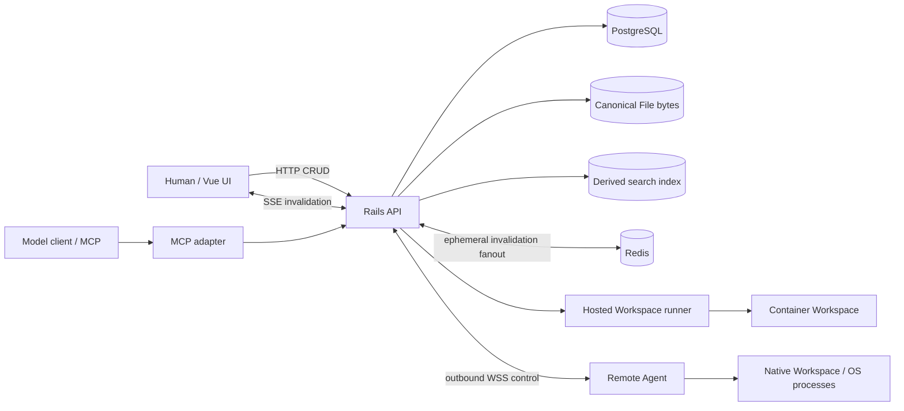

# Later, Bender

> **Your context is temporary. My shiny metal ass is persistent.**

Later Bender is a durable working-state layer shared by humans and model clients.
It keeps the parts of technical work that should survive a chat: actionable Tasks,
editable Notes, canonical Files and evidence, Credentials, and enough execution
state to let a model leave one conversation and continue somewhere else without
reconstructing the project from prose.

It is deliberately not a model-specific memory plugin and not Jira with an MCP
adapter bolted on. The browser UI, JSON API, and MCP server are first-class clients
of the same canonical state.

`<screenshot: Later Bender Tasks board with several LB-* tasks, project scope in the sidebar, and a selected task detail pane>`

## Why this exists

Long model conversations are useful working memory and terrible durable storage.
They accumulate discoveries, decisions, failed approaches, logs, files, commands,
and unfinished work until the conversation ends, the harness truncates something,
or another model has to take over.

Later Bender makes the boundary explicit:

| Thing | Role |
| --- | --- |
| **Chat** | transient reasoning and immediate working context |
| **Task** | durable actionable work and commitments |
| **Note** | durable mutable non-actionable context: decisions, findings, constraints, hypotheses, rationale |
| **File** | immutable canonical artifact or evidence |
| **Citation** | durable exact pointer into a File representation |
| **Search** | semantic/lexical recall across durable state |
| **Workspace** | transient execution state |
| **Credential** | durable secret metadata and an explicit Workspace binding |
| **Remote Agent** | user-owned execution target behind the same Workspace abstraction |

The intended workflow is not "save the whole conversation." It is to keep compact
project state compact, preserve large evidence separately, and make it cheap for a
model to descend from a remembered conclusion to the exact source when it needs to.

## One state surface for humans and models

A model can create a Task, a human can move it on the board, another model can
search for it later, and the browser updates when the change happens elsewhere.
There is no separate "AI memory" database that quietly diverges from the UI.

The human frontend currently exposes Tasks, semantic Search, Notes, Files,
Workspaces, Credentials, and Remote Agent administration. Browser reads and
mutations use the normal HTTP API; a small authenticated SSE channel carries
invalidation hints so changes made by models or other clients appear without a
manual refresh. PostgreSQL remains canonical. Redis is used only for disposable
cross-process invalidation fanout.

`<screenshot: global Search showing mixed Task, Note, and File results, including a File result with a line/page locator>`

## The model-facing part is the point

Later Bender's MCP interface is shaped around workflows models already perform
well: fuzzy recall, exact fetch, bounded evidence reads, explicit mutation, and
normal command execution.

A cold client does not need a Later-Bender-specific agent framework. The server
advertises ordinary MCP tools such as:

```text
search_memory         get_task / get_note
list_tasks / notes     create_task / update_task
list_files             get_file / read_file
list_archive           read_archive_entry
create_workspace       exec_workspace
read_workspace_file    promote_workspace_file
list_workspace_targets list_credentials
```

The full surface also includes batch fetches, exact Note editing, File ingestion
and egress, archive extraction, Workspace transcripts/output/cancellation, and
Remote-Agent-aware Workspace placement.

### Recall first, fetch exact state second

Search results are intentionally compact summaries. They identify the canonical
object and enough matching context to decide what to fetch next.

```text
search_memory("why did we choose WSS for remote agents?")
    |
    +-- Task LB-107
    +-- Note 125
    +-- File LB-F... with representation + locator
```

The model then fetches the exact Task or Note rather than treating a search snippet
as authoritative state.

This distinction matters in long-lived projects: search is a recall mechanism;
canonical objects are the state.

## Evidence without context stuffing

Files are not just attachments. They are immutable canonical evidence with
rebuildable readable representations.

A large transcript, log, PDF, patch, source document, archive, or generated artifact
can remain a File while the useful conclusion is distilled into a Task or Note.
The Task/Note can then point back to the exact evidence.

For example, a model can search for a decision, follow the related File, read only
the relevant range, and preserve that exact range as a citation:

```text
search_memory("credential provisioning crash semantics")
    |
    v
get_note(100)
    |
    v
read_file("LB-F41", representation="markdown",
          locator={ kind: "lines", start: 202, end: 260 })
    |
    v
update_task("LB-85", citations=[
  {
    file: "LB-F41",
    representation: "markdown",
    locator: { kind: "lines", start: 202, end: 260 }
  }
])
```

A **relationship** says "this File is relevant to this Task or Note." A **citation**
says "this exact range is evidence for it." They are separate concepts on purpose.

Readable Files support bounded line/page locators instead of forcing the model to
pull an entire document into context. Search results carry usable representation
and locator data, and reads can continue through bounded ranges when more material
is needed.

### Archives stay archives

Later Bender does not eagerly explode an archive into a pile of fake canonical
Files. The archive keeps one identity and provenance:

```text
LB-F27 build-artifacts.zip
    |
    +-- list_archive
    +-- read_archive_entry("logs/test.log")
    `-- extract_archive_entry(...)   # only when a standalone canonical File is wanted
```

Listing and member reads are bounded and defensive. Extraction is explicit.

### Canonical bytes stay canonical

File bytes are immutable. Search indexes and readable representations are derived
and rebuildable. Model-facing contracts expose Later Bender File refs and locators,
not Active Storage IDs, search-index chunk IDs, or storage implementation details.

That keeps evidence references meaningful even as the retrieval implementation
changes.

## Workspaces: transient execution next to durable state

Memory and execution are different problems. Later Bender keeps them different.

A hosted Workspace gives a model a normal execution environment for repository
work, binary inspection, compilation, transformation, network access, and arbitrary
engineering tools. Its filesystem is transient; Later Bender state is not mounted
into it ambiently.

For hosted Workspaces, the model moves data across that boundary explicitly:

```text
canonical File
    |
    | put_file_in_workspace
    v
Workspace filesystem
    |
    | edit / compile / inspect / run / generate
    v
Workspace artifact
    |
    | promote_workspace_file
    v
new canonical File
```

Likewise, command output and the Workspace execution transcript stay transient
unless a model deliberately promotes them into a canonical File.

Remote native Workspaces currently share the execution/lifecycle grammar but do
not yet implement canonical File ingress/promotion or Credential delivery. Those
are deliberately not faked behind the provider-neutral surface.

A normal hosted model workflow can therefore be:

```text
1. search durable state
2. fetch the Task and supporting evidence
3. create a Workspace
4. put selected Files into it
5. inspect a repo / run tests / build something
6. promote useful artifacts or transcript evidence
7. update the Task or Note with the conclusion and citations
8. destroy the Workspace
```

Workspaces support shell or argv execution, cwd/env/stdin, bounded synchronous fast
paths, long-running execution observation, incremental stdout/stderr reads,
timeouts, cancellation, transcript inspection, and explicit artifact promotion.

`<screenshot: Workspaces view showing a hosted and/or remote Workspace with status and execution information>`

### The runtime is provider-neutral

The same Workspace grammar can target the hosted container runtime or a user-owned
Remote Agent:

```text
list_workspace_targets()

create_workspace()
# -> hosted execution target

create_workspace(target="RA-3", executor="native")
# -> native execution on an enrolled remote machine
```

Infrastructure details stay behind that boundary. Models discover useful facts such
as OS, architecture, availability, executor type, capabilities, and meaningful
resource limits; they do not manage Kubernetes pods, Docker IDs, tunnels, or
provider-specific operation machinery.

Hosted Workspaces are containerized execution environments, not hardened sandboxes.
Native Remote Agent Workspaces are explicitly **not sandboxes**: commands execute
with the authority of the OS account running the Agent.

## Remote Agents

A Remote Agent is a user-owned machine that joins Later Bender as an execution
target while keeping the Workspace tool family unchanged.

The current native Agent is a small Go runtime. It generates and retains its own
Ed25519 identity, enrolls with a one-use token, establishes an outbound authenticated
WSS control session, advertises its runtime capabilities, and reconciles Workspace
operations against canonical Rails/PostgreSQL state after reconnects.

The control socket is transport, not truth. Stable operation identities and
reconciliation make reconnect cheap; a replacement session fences the old one.
Laptop sleep, network loss, or socket degradation are availability interruptions,
not reasons to pretend a continuous execution session survived.

`<screenshot: Remote Agents page with an online native agent selected, capability facts, Administration actions, and the native-execution trust warning>`

The human UI manages enrollment, identity, status, rename/revoke, and the execution
trust boundary. Workspace placement itself remains model-facing: models discover
targets and choose where to execute.

## Credentials

Credentials are durable user-owned secret records with safe metadata and explicit
Workspace bindings. Credential binding is currently implemented for hosted
Workspaces; Remote Agent credential delivery is a later runtime slice.

The model can discover metadata such as `CRED-*` refs and choose which Credentials
to bind when creating a hosted Workspace, but MCP does not provide a "read secret
value" tool. Secret values are injected only into the selected execution
environment.

Current binding forms are:

- environment variables;
- controlled files under `/root/...` with explicit modes.

Bindings are snapshotted for the hosted Workspace lifetime. Updating or deleting
the source Credential does not silently mutate an already-running Workspace.
Per-execution `secret_env` remains available for one-off hosted executions; the
current native Remote Agent executor does not yet support it.

The practical boundary is intentional: a process running inside a Workspace that
has been given a secret can use or reveal that secret. Later Bender prevents
accidental leakage through normal API/MCP projections, transcripts, and runtime
bookkeeping; it does not claim DLP against the workload that was deliberately given
the credential.

## Stable identities instead of framework leakage

Model-facing identities are compact and durable:

```text
Project:       later-bender / shorthand LB
Task:          LB-110
File:          LB-F41
Credential:    CRED-3
Workspace:     WS-12
Execution:     WSE-...
Remote Agent:  RA-3
```

Internal Rails/database identities are not the model contract. Browse operations use
deterministic ordering and cursor pagination where appropriate; exact operations use
stable external refs.

This seems small, but it matters when several model vendors, a human UI, and durable
state all have to refer to the same thing without sharing implementation details.

## Model-agnostic by construction

Later Bender has been designed and dogfooded through multiple model clients. The
useful test is not whether a model has been specially prompted with the product's
history; it is whether a fresh capable client can inspect the advertised tools and
compose them correctly.

The contract therefore prefers boring, explicit operations over hidden agent magic:

- approximate recall -> exact fetch;
- relationships -> exact citations when evidence matters;
- explicit File transfer across supported execution boundaries;
- explicit Workspace lifecycle;
- provider-neutral targets;
- canonical state outside any model conversation.

That also makes a custom model loop straightforward: provide the MCP tool schemas,
execute requested calls, append results, and continue until the model emits a
terminal response. The durable state is not owned by the chat harness.

## Architecture



The important authority boundaries are simple:

- **PostgreSQL + canonical File bytes** own durable product state and evidence.
- **Search indexes and Redis** are derived/disposable infrastructure.
- **Workspaces** own transient execution state.
- **Remote Agent runtime state** is evidence used to reconcile operations, not a
  second product database.

## Human UI

The frontend is Vue 3 + Vite + Pinia. It intentionally reuses familiar interaction
patterns where useful instead of inventing a special "AI workspace" UI.

Tasks use a compact board because board muscle memory is useful. Notes remain a
separate durable-memory surface rather than pseudo-tasks. Search spans the same
Tasks, Notes, and readable Files available to model clients. Files expose canonical
metadata/evidence. Credentials and Remote Agents expose administration appropriate
for humans, while execution placement remains in the model-facing Workspace tools.

`<screenshot: Notes or Files detail view showing durable prose/evidence relationships and citations>`

## Repository layout

```text
backend/   Rails API, canonical state, search integration, SSE, Workspace orchestration
mcp/       TypeScript Streamable HTTP MCP adapter and schemas
frontend/  Vue/Vite/Pinia human client
agent/     Go native Remote Agent runtime
runner/    hosted Workspace runner
```

[`AGENTS.md`](AGENTS.md) is the concise engineering/architecture entry point.
[`OPERATIONS.md`](OPERATIONS.md) is the authoritative validation and deployment
guide.

## Development

Canonical checks are intentionally ordinary:

```sh
cd backend && bin/ci
cd mcp && npm test && npm run build
cd frontend && npm ci && npm run build
cd agent && go test ./... && go build ./...
```

`backend/bin/ci` runs the backend RSpec suite, OpenAPI drift check, RuboCop,
MCP tests/build, bundler-audit, and Brakeman. Frontend rendered acceptance uses
Playwright and authenticated test credentials; see [`OPERATIONS.md`](OPERATIONS.md)
for the current procedure.

Later Bender currently runs as a real production/dogfood system, but the repository
is still optimized for active development rather than a one-command public
self-hosting experience. The current deployment is MicroK8s-based and documented in
`OPERATIONS.md`; do not infer that deployment topology from the application
contracts themselves.

## Current scope

Later Bender is intentionally narrower than an enterprise project-management or
agent-orchestration platform.

It does not currently try to provide organization/RBAC machinery, workflow-builder
ceremony, automatic Jira semantics, a tool for every file format, a scheduler/failover
platform, or a universal sandbox. New infrastructure is added when a concrete
workflow earns it.

The project is primarily interested in a simpler question:

**Can a human and a succession of different model clients share enough explicit,
durable, citable state and execution machinery that useful engineering work survives
the conversation that produced it?**

That is what Later Bender is built to answer.
